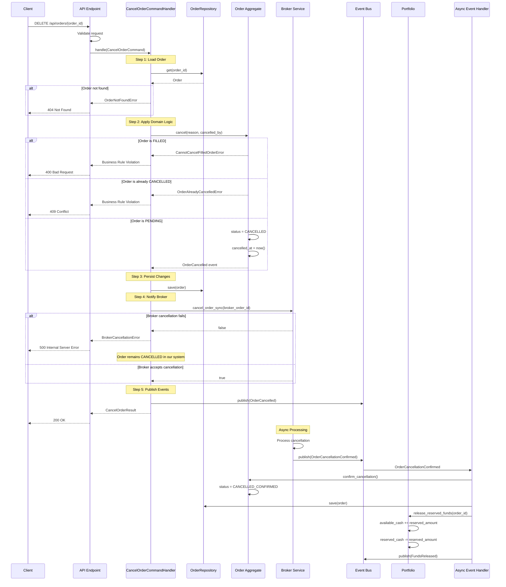
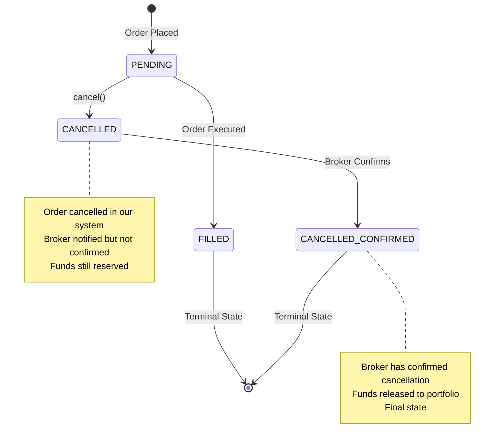

# Cancel Order Flow Documentation

## Overview

This document describes the complete flow for cancelling a trading order in the system, from API request to final state update. The cancellation process involves multiple layers including API handling, command processing, domain logic, broker integration, and asynchronous event handling.

## Table of Contents
- [High-Level Flow](#high-level-flow)
- [Detailed Sequence Diagram](#detailed-sequence-diagram)
- [Component Responsibilities](#component-responsibilities)
- [Event Flow](#event-flow)
- [Error Scenarios](#error-scenarios)
- [State Transitions](#state-transitions)
- [Implementation Details](#implementation-details)

## High-Level Flow

1. **API Request**: Client sends DELETE request to `/api/orders/{order_id}`
2. **Command Creation**: API endpoint creates `CancelOrderCommand`
3. **Domain Logic**: Order aggregate's `cancel()` method enforces business rules
4. **Event Publishing**: `OrderCancelled` event is published
5. **Broker Notification**: Synchronous call to broker to cancel order
6. **Async Confirmation**: Broker sends async confirmation of cancellation
7. **Event Processing**: `OrderCancellationConfirmed` event triggers fund release
8. **Portfolio Update**: Reserved funds are released back to available cash

## Detailed Sequence Diagram



## Component Responsibilities

### API Endpoint (`DELETE /api/orders/{order_id}`)
- Validates HTTP request
- Authenticates and authorizes user
- Creates `CancelOrderCommand` with appropriate parameters
- Handles errors and returns appropriate HTTP status codes

### CancelOrderCommandHandler
- Orchestrates the cancellation flow
- Loads order from repository
- Delegates to domain aggregate for business logic
- Manages broker communication
- Publishes domain events
- Handles errors and exceptions

### Order Aggregate
- Enforces business rules:
  - Cannot cancel filled orders
  - Cannot cancel already cancelled orders
  - Only pending orders can be cancelled
- Updates order state
- Creates domain events

### Broker Service
- Sends cancellation request to external broker
- Returns success/failure status
- Sends async confirmation when cancellation is complete

### Event Bus
- Distributes events to interested handlers
- Ensures reliable event delivery
- Supports both sync and async event processing

### Portfolio
- Manages fund reservations
- Releases reserved funds when orders are cancelled
- Maintains available and reserved cash balances

## Event Flow

### 1. OrderCancelled Event
```python
@dataclass
class OrderCancelled(DomainEvent):
    order_id: UUID
    reason: str
    cancelled_at: datetime
    cancelled_by: UUID
    symbol: str
    original_quantity: int
    order_type: str
    unfilled_quantity: int
```

**Published when**: Order status changes from PENDING to CANCELLED
**Handled by**: 
- Notification service (send email/push notification)
- Audit service (log cancellation)
- Analytics service (track cancellation metrics)

### 2. OrderCancellationConfirmed Event
```python
@dataclass
class OrderCancellationConfirmed(DomainEvent):
    order_id: UUID
    broker_order_id: str
    confirmed_at: datetime
```

**Published when**: Broker confirms cancellation completion
**Handled by**:
- OrderCancellationConfirmedHandler (updates order status)
- PortfolioService (releases reserved funds)

### 3. FundsReleased Event
```python
@dataclass
class FundsReleased(DomainEvent):
    portfolio_id: UUID
    order_id: UUID
    amount: Decimal
    currency: str
```

**Published when**: Reserved funds are released back to available
**Handled by**:
- Notification service (notify user of fund availability)
- Reporting service (update portfolio metrics)

## Error Scenarios

### 1. Order Not Found
**Scenario**: Attempting to cancel a non-existent order
```python
if not order:
    raise OrderNotFoundError(f"Order {order_id} not found")
```
**HTTP Response**: 404 Not Found
**Client Action**: Verify order ID and retry if necessary

### 2. Order Already Filled
**Scenario**: Attempting to cancel an order that has been executed
```python
if self.status == OrderStatus.FILLED:
    raise CannotCancelFilledOrderError(
        f"Order {self.id} is already filled and cannot be cancelled"
    )
```
**HTTP Response**: 400 Bad Request
**Client Action**: No action needed, order already executed

### 3. Order Already Cancelled
**Scenario**: Attempting to cancel an already cancelled order
```python
if self.status == OrderStatus.CANCELLED:
    raise OrderAlreadyCancelledError(
        f"Order {self.id} is already cancelled"
    )
```
**HTTP Response**: 409 Conflict
**Client Action**: No action needed, order already cancelled

### 4. Broker Cancellation Failure
**Scenario**: Broker rejects or fails to process cancellation
```python
if not broker_success:
    raise BrokerCancellationError(
        f"Broker failed to cancel order {order.broker_order_id}"
    )
```
**HTTP Response**: 500 Internal Server Error
**System Behavior**: 
- Order remains CANCELLED in our system (business decision)
- Alert sent to operations team
- Retry mechanism may be triggered

### 5. Network/Timeout Errors
**Scenario**: Network failure during broker communication
```python
try:
    broker_success = self._broker_service.cancel_order_sync(order.broker_order_id)
except TimeoutError:
    # Handle timeout
except NetworkError:
    # Handle network failure
```
**HTTP Response**: 503 Service Unavailable
**System Behavior**: 
- Implement retry with exponential backoff
- Queue cancellation for later processing
- Alert monitoring systems

## State Transitions



## Implementation Details

### Synchronous vs Asynchronous Operations

**Synchronous Operations**:
1. Order state change (PENDING → CANCELLED)
2. Initial broker notification
3. Event publishing to bus
4. API response to client

**Asynchronous Operations**:
1. Broker cancellation confirmation
2. Fund release in portfolio
3. Notification sending
4. Analytics and reporting updates

### Idempotency Considerations

The cancellation process should be idempotent:
```python
# Check if already cancelled before processing
if order.status in [OrderStatus.CANCELLED, OrderStatus.CANCELLED_CONFIRMED]:
    return CancelOrderResult(
        success=True,
        order_id=order_id,
        message="Order already cancelled",
        cancelled_at=order.cancelled_at
    )
```

### Compensation Logic

If broker cancellation fails after order is marked as CANCELLED:
1. **Option 1** (Current): Keep order as CANCELLED in our system
   - Pro: Consistent user experience
   - Con: Potential mismatch with broker state
   
2. **Option 2**: Rollback to PENDING
   - Pro: Consistent with broker state
   - Con: Complex rollback logic, poor user experience

3. **Option 3**: Mark with special status (CANCELLATION_FAILED)
   - Pro: Clear indication of issue
   - Con: Additional complexity in state management

### Testing Strategies

1. **Unit Tests** (`tests/unit/application/test_cancel_order.py`):
   - Test each component in isolation
   - Mock all dependencies
   - Verify business rules enforcement

2. **Integration Tests** (`tests/integration/test_order_lifecycle.py`):
   - Test complete flow with real implementations
   - Verify event publishing and handling
   - Test error scenarios

3. **End-to-End Tests**:
   - Test from API to database
   - Include broker simulator
   - Verify async event processing

### Monitoring and Observability

Key metrics to track:
- Cancellation success rate
- Average cancellation latency
- Broker confirmation delay
- Failed cancellation reasons
- Fund release timing

Key logs:
```python
logger.info(f"Processing cancel order command for order {order_id}")
logger.debug(f"Order {order_id} status: {order.status}")
logger.warning(f"Broker failed to cancel order {broker_order_id}")
logger.error(f"Unexpected error in cancellation: {error}")
```

### Security Considerations

1. **Authorization**: Verify user can cancel this specific order
2. **Audit Trail**: Log all cancellation attempts with user ID
3. **Rate Limiting**: Prevent cancellation spam
4. **Validation**: Sanitize cancellation reason input

## Configuration

### Timeouts
```yaml
broker:
  cancellation_timeout: 5000ms  # Sync call timeout
  confirmation_timeout: 30000ms # Max wait for async confirmation

retry:
  max_attempts: 3
  backoff_multiplier: 2
  initial_delay: 1000ms
```

### Feature Flags
```yaml
features:
  allow_force_cancel: false  # Allow cancelling without broker confirmation
  auto_retry_failed: true    # Automatically retry failed cancellations
  release_funds_on_cancel: true  # Release funds immediately or wait for confirmation
```

## Related Documentation

- [Place Order Flow](./place_order_flow.md)
- [Order State Machine](../architecture/order_state_machine.md)
- [Event Sourcing Strategy](../architecture/event_sourcing.md)
- [Broker Integration Guide](../integration/broker_api.md)