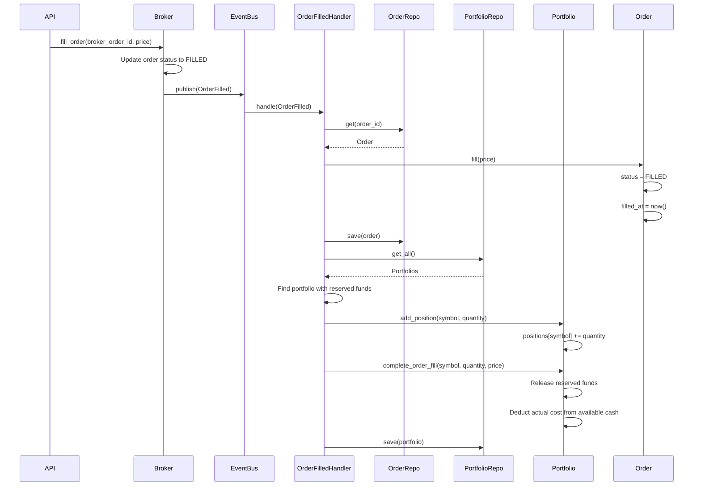

# Order Fill Event Flow

## Overview
When a broker executes an order, the system updates the portfolio with the new position and adjusts cash balances based on the actual fill price.

## Flow Sequence



## Key Components

### 1. MockBrokerService.fill_order()
- Validates order exists and is PENDING
- Updates broker's internal status to FILLED
- Publishes OrderFilled domain event
- Returns success/failure status

### 2. OrderFilledEventHandler
- Subscribes to "order.filled" events
- Loads order and portfolio from repositories
- Updates order status to FILLED
- Adds position to portfolio
- Adjusts portfolio cash (converts reserved → spent)
- Handles edge cases (no portfolio found)

### 3. Portfolio Aggregate
- `add_position()`: Accumulates positions for the same symbol
- `complete_order_fill()`: Adjusts cash for actual fill price
  - Releases all reserved funds
  - Deducts actual cost from available cash
  - Tracks the transaction

### 4. Order Aggregate
- `fill()`: Updates order status and timestamp
- Generates OrderFilled domain event
- Enforces business rules (cannot fill cancelled orders)

## Business Rules

1. **Order Fill Rules**:
   - Only PENDING orders can be filled
   - Cannot fill CANCELLED orders
   - Cannot fill already FILLED orders
   - Fill timestamp is recorded

2. **Portfolio Updates**:
   - Positions accumulate (buying more of same symbol adds to position)
   - Reserved funds are fully released on fill
   - Actual fill price determines final cost
   - If fill price < reserved amount, excess is returned to available cash
   - If fill price > reserved amount (shouldn't happen), system handles gracefully

3. **Cash Management**:
   - When order placed: `available_cash -= estimated_cost`, `reserved_cash += estimated_cost`
   - When order filled: `reserved_cash = 0`, `available_cash -= actual_cost`
   - When order cancelled: `reserved_cash -= estimated_cost`, `available_cash += estimated_cost`

## Testing

The system includes comprehensive integration tests that verify:
- Complete order lifecycle (place → fill → position)
- Multiple orders for same symbol accumulate correctly
- Different fill prices adjust cash properly
- Partial fill scenarios (lower actual price than estimated)
- Graceful handling when portfolio not found

## API Usage

### Place Order
```bash
POST /api/v1/orders
{
  "portfolio_id": "...",
  "symbol": "AAPL",
  "quantity": 10,
  "order_type": "MARKET"
}
```

### Fill Order (Testing)
```bash
POST /api/v1/orders/{order_id}/fill
{
  "fill_price": 150.50  // Optional, uses market price if not provided
}
```

### Check Portfolio
```bash
GET /api/v1/portfolios/{portfolio_id}
# Returns available_cash, reserved_cash, positions
```

## Implementation Notes

1. **Event Subscription**: The handler subscribes to "order.filled" not "OrderFilled"
2. **Portfolio Discovery**: Currently uses heuristic (reserved funds > 0) to find portfolio
3. **Future Improvements**:
   - Track portfolio_id in order or event
   - Support partial fills
   - Add transaction history
   - Implement P&L tracking