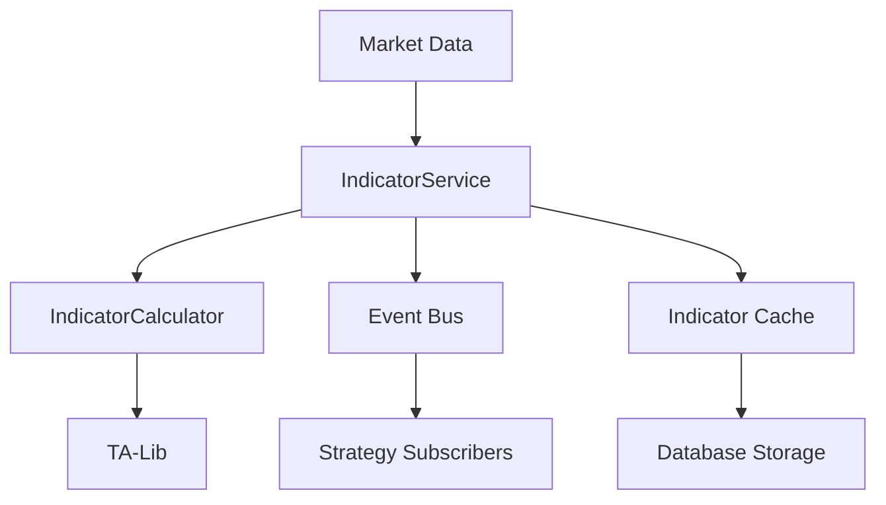

# Indicator Calculation Module Documentation

## Module Overview

The Indicator Calculation module provides a comprehensive library of technical indicators for market analysis. It supports both real-time calculation on streaming data and batch processing of historical data, with event-driven publishing for strategy consumption.

**Location**: `src/infrastructure/indicators/`  
**Status**: ✅ **95% Complete**  
**Test Coverage**: ~70%

## Architecture



## Current Implementation

### Core Components

#### 1. **IndicatorCalculator** (`indicator_calculator.py`)
- Core calculation engine
- 20+ technical indicators
- Optimized for performance
- Handles edge cases and NaN values

#### 2. **IndicatorService** (`indicator_service.py`)
- Orchestrates indicator calculations
- Manages real-time updates
- Caches results
- Publishes indicator events

### Implemented Indicators

#### Trend Indicators
| Indicator | Function | Parameters | Description |
|-----------|----------|------------|-------------|
| SMA | `calculate_sma()` | period | Simple Moving Average |
| EMA | `calculate_ema()` | period | Exponential Moving Average |
| WMA | `calculate_wma()` | period | Weighted Moving Average |
| TEMA | `calculate_tema()` | period | Triple Exponential Moving Average |
| HMA | `calculate_hma()` | period | Hull Moving Average |
| Ichimoku | `calculate_ichimoku()` | multiple | Ichimoku Cloud components |

#### Momentum Indicators
| Indicator | Function | Parameters | Description |
|-----------|----------|------------|-------------|
| RSI | `calculate_rsi()` | period=14 | Relative Strength Index |
| MACD | `calculate_macd()` | fast=12, slow=26, signal=9 | Moving Average Convergence Divergence |
| Stochastic | `calculate_stochastic()` | k=14, d=3 | Stochastic Oscillator |
| Williams %R | `calculate_williams_r()` | period=14 | Williams Percent Range |
| CCI | `calculate_cci()` | period=20 | Commodity Channel Index |
| ROC | `calculate_roc()` | period=10 | Rate of Change |

#### Volatility Indicators
| Indicator | Function | Parameters | Description |
|-----------|----------|------------|-------------|
| Bollinger Bands | `calculate_bollinger_bands()` | period=20, std=2 | Upper, middle, lower bands |
| ATR | `calculate_atr()` | period=14 | Average True Range |
| Keltner Channels | `calculate_keltner()` | period=20, mult=2 | Channel bands |
| Donchian Channels | `calculate_donchian()` | period=20 | Highest high, lowest low |
| Standard Deviation | `calculate_std()` | period=20 | Price volatility |

#### Volume Indicators
| Indicator | Function | Parameters | Description |
|-----------|----------|------------|-------------|
| OBV | `calculate_obv()` | - | On-Balance Volume |
| VWAP | `calculate_vwap()` | - | Volume Weighted Average Price |
| Volume Profile | `calculate_volume_profile()` | bins=20 | Price level volume distribution |
| MFI | `calculate_mfi()` | period=14 | Money Flow Index |
| CMF | `calculate_cmf()` | period=20 | Chaikin Money Flow |

## Usage Examples

### Basic Indicator Calculation

```python
from src.infrastructure.indicators.indicator_calculator import IndicatorCalculator
import pandas as pd

# Load price data
df = pd.DataFrame({
    'close': [100, 102, 101, 103, 105, 104, 106],
    'high': [101, 103, 102, 104, 106, 105, 107],
    'low': [99, 101, 100, 102, 104, 103, 105],
    'volume': [1000, 1200, 900, 1100, 1300, 1000, 1400]
})

calculator = IndicatorCalculator()

# Calculate SMA
sma = calculator.calculate_sma(df['close'], period=3)

# Calculate RSI
rsi = calculator.calculate_rsi(df['close'], period=14)

# Calculate MACD
macd_result = calculator.calculate_macd(df['close'])
macd_line = macd_result['macd']
signal_line = macd_result['signal']
histogram = macd_result['histogram']

# Calculate Bollinger Bands
bb_result = calculator.calculate_bollinger_bands(df['close'])
upper_band = bb_result['upper']
middle_band = bb_result['middle']
lower_band = bb_result['lower']
```

### Real-time Indicator Updates

```python
from src.infrastructure.indicators.indicator_service import IndicatorService

# Initialize service
service = IndicatorService(
    db_session=session,
    event_bus=event_bus
)

# Configure indicators for a symbol
await service.configure_indicators(
    symbol="BTCUSDT",
    indicators=[
        {'name': 'SMA', 'params': {'period': 20}},
        {'name': 'RSI', 'params': {'period': 14}},
        {'name': 'MACD', 'params': {'fast': 12, 'slow': 26, 'signal': 9}}
    ]
)

# Service will automatically calculate on new data
# and publish events
```

### Batch Historical Calculation

```python
# Calculate all indicators for historical data
indicators = service.calculate_all_indicators(
    symbol="BTCUSDT",
    start_date="2024-01-01",
    end_date="2024-12-31",
    interval="1h"
)

# Results include all configured indicators
print(indicators['SMA_20'])
print(indicators['RSI_14'])
print(indicators['MACD'])
```

## Event Publishing

### Indicator Events

The module publishes events when indicators are calculated:

```python
# Event structure
{
    'type': 'indicator.calculated',
    'symbol': 'BTCUSDT',
    'interval': '1h',
    'indicator': 'RSI',
    'value': 65.4,
    'timestamp': '2024-01-15 10:00:00',
    'metadata': {
        'period': 14,
        'overbought': False,
        'oversold': False
    }
}
```

### Subscribing to Events

```python
# Subscribe to specific indicator
event_bus.subscribe(
    'indicator.rsi.calculated',
    handle_rsi_update
)

# Subscribe to all indicators
event_bus.subscribe(
    'indicator.*',
    handle_any_indicator
)
```

## Performance Optimization

### Caching Strategy

```python
# Indicators are cached with TTL
cache_config = {
    'ttl': 300,  # 5 minutes
    'max_size': 1000,  # Maximum cached items
    'strategy': 'LRU'  # Least Recently Used
}
```

### Batch Processing

```python
# Process multiple symbols efficiently
symbols = ['BTCUSDT', 'ETHUSDT', 'BNBUSDT']
results = await service.batch_calculate(
    symbols=symbols,
    indicators=['SMA', 'RSI', 'MACD'],
    parallel=True
)
```

## Configuration

### Indicator Configuration File

```yaml
# config/indicators.yaml
indicators:
  trend:
    - name: SMA
      periods: [10, 20, 50, 200]
      enabled: true
    - name: EMA
      periods: [12, 26, 50]
      enabled: true
      
  momentum:
    - name: RSI
      period: 14
      overbought: 70
      oversold: 30
      enabled: true
    - name: MACD
      fast: 12
      slow: 26
      signal: 9
      enabled: true
      
  volatility:
    - name: BollingerBands
      period: 20
      std_dev: 2
      enabled: true
    - name: ATR
      period: 14
      enabled: true
```

## Custom Indicator Development

### Creating Custom Indicators

```python
class CustomIndicator:
    @staticmethod
    def calculate_custom(prices: pd.Series, **params) -> pd.Series:
        """
        Custom indicator implementation
        """
        # Your calculation logic here
        result = prices.rolling(window=params['period']).apply(
            lambda x: custom_calculation(x)
        )
        return result

# Register custom indicator
calculator.register_custom_indicator(
    'CUSTOM_IND',
    CustomIndicator.calculate_custom
)
```

## Testing

### Unit Tests

```bash
# Run indicator tests
pytest tests/infrastructure/indicators/ -v

# Test specific indicator
pytest tests/infrastructure/indicators/test_rsi.py -v
```

### Performance Tests

```python
# Benchmark indicator calculations
python scripts/indicators/benchmark_indicators.py

# Results:
# SMA: 0.001s per 1000 bars
# EMA: 0.002s per 1000 bars
# RSI: 0.003s per 1000 bars
# MACD: 0.004s per 1000 bars
```

## Performance Metrics

| Metric | Current | Target |
|--------|---------|--------|
| Calculation Speed | 1000 bars/ms | 2000 bars/ms |
| Memory Usage | ~100MB | <200MB |
| Cache Hit Rate | 85% | >90% |
| Event Latency | <10ms | <5ms |

## Integration Points

### Strategy Integration

Strategies consume indicators via:

```python
class MyStrategy:
    def __init__(self):
        self.indicators = {
            'sma_20': None,
            'rsi_14': None
        }
    
    def on_indicator_update(self, event):
        if event.indicator == 'SMA_20':
            self.indicators['sma_20'] = event.value
        elif event.indicator == 'RSI_14':
            self.indicators['rsi_14'] = event.value
        
        self.check_signals()
```

### Database Storage

```sql
-- Indicator values table
CREATE TABLE indicator_values (
    id SERIAL PRIMARY KEY,
    symbol VARCHAR(20) NOT NULL,
    interval VARCHAR(10) NOT NULL,
    indicator_name VARCHAR(50) NOT NULL,
    timestamp TIMESTAMP NOT NULL,
    value DECIMAL(20, 8),
    metadata JSONB,
    created_at TIMESTAMP DEFAULT NOW(),
    UNIQUE(symbol, interval, indicator_name, timestamp)
);

CREATE INDEX idx_indicator_lookup 
ON indicator_values(symbol, indicator_name, timestamp DESC);
```

## Known Issues

1. **NaN Handling**: Some indicators produce NaN for initial periods
2. **Memory Usage**: Large lookback periods can consume significant memory
3. **Calculation Lag**: Complex indicators may lag during high-frequency updates
4. **Edge Cases**: Some indicators behave unexpectedly with extreme values

## Future Enhancements

### High Priority
- [ ] Machine learning indicators
- [ ] Custom indicator framework
- [ ] GPU acceleration for calculations
- [ ] Indicator combination strategies

### Medium Priority
- [ ] Pattern recognition indicators
- [ ] Market breadth indicators
- [ ] Sentiment indicators
- [ ] Cross-asset correlations

### Low Priority
- [ ] Alternative data indicators
- [ ] Fractal analysis
- [ ] Wavelet transforms
- [ ] Neural network indicators

## Troubleshooting

### Common Issues

**NaN Values in Indicators**
```python
# Check for NaN
if pd.isna(indicator_value):
    # Use forward fill
    indicator_value = df['indicator'].fillna(method='ffill')
```

**Slow Calculation**
```python
# Use vectorized operations
# Bad
for i in range(len(prices)):
    sma[i] = sum(prices[i-period:i]) / period

# Good
sma = prices.rolling(window=period).mean()
```

**Memory Issues**
```python
# Reduce calculation window
service.set_max_lookback(1000)  # Limit to 1000 bars

# Clear cache
service.clear_indicator_cache()
```

## Dependencies

- `ta`: Technical Analysis library
- `pandas`: Data manipulation
- `numpy`: Numerical calculations
- `scipy`: Scientific computing
- `numba`: JIT compilation for performance

## Related Modules

- **Data Fetching**: Provides price data for calculations
- **Strategy**: Consumes indicator signals
- **Backtesting**: Uses indicators for historical testing
- **Risk Management**: Uses volatility indicators

## Best Practices

1. **Always validate input data** before calculation
2. **Handle NaN values** appropriately
3. **Use vectorized operations** for performance
4. **Cache frequently used indicators**
5. **Monitor calculation performance**
6. **Test edge cases** thoroughly

## Contact & Support

For issues or questions about this module:
1. Check calculation logs in `logs/indicators/`
2. Review test cases in `tests/infrastructure/indicators/`
3. Consult TA-Lib documentation for standard indicators