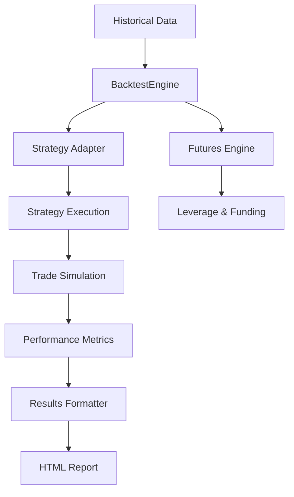

# Backtesting Engine Module Documentation

## Module Overview

The Backtesting Engine provides comprehensive historical simulation capabilities for testing trading strategies. It features realistic fee modeling, futures support with leverage and funding fees, and generates detailed performance metrics with interactive visualizations.

**Location**: `src/infrastructure/backtesting/`  
**Status**: ✅ **90% Complete**  
**Test Coverage**: ~75%

## Architecture



## Current Implementation

### Core Components

#### 1. **BacktestEngine** (`backtest_engine.py`)
- Main orchestrator for backtests
- Wraps backtesting.py library
- Handles data validation
- Generates performance metrics

#### 2. **FuturesBacktestEngine** (`futures_backtest_engine.py`)
- Specialized for futures trading
- Leverage simulation
- Funding fee calculation
- Liquidation modeling

#### 3. **StrategyAdapter** (`strategy_adapter.py`)
- Bridges strategies to backtest engine
- Signal translation
- Position management
- Risk control integration

#### 4. **ResultsFormatter** (`results_formatter.py`)
- Formats backtest output
- Generates HTML reports
- Creates performance charts
- Exports to multiple formats

### Key Features

✅ **Realistic Simulation**
- Accurate fee modeling
- Slippage simulation
- Market impact estimation
- Partial fill simulation

✅ **Futures Support**
- Leverage up to 125x
- Funding fee calculation
- Liquidation price tracking
- Cross/Isolated margin

✅ **Performance Metrics**
- Sharpe ratio
- Maximum drawdown
- Win rate & profit factor
- Risk-adjusted returns

✅ **Visualization**
- Interactive HTML charts
- Equity curves
- Drawdown charts
- Trade distribution

## Usage Examples

### Basic Backtest

```python
from src.infrastructure.backtesting.backtest_engine import BacktestEngine
from src.application.backtesting.strategies.sma_cross_strategy import SmaCrossStrategy
import pandas as pd

# Initialize engine
engine = BacktestEngine()

# Load historical data
data = pd.read_csv('data/BTCUSDT_1h.csv', index_col='timestamp', parse_dates=True)

# Run backtest
results = engine.run_backtest(
    data=data,
    strategy_class=SmaCrossStrategy,
    initial_cash=10000,
    commission=0.002,  # 0.2% commission
    margin=1.0,        # No leverage
    n1=10,             # Strategy parameters
    n2=20,
    stop_loss_pct=0.02
)

# Access results
print(f"Total Return: {results.stats['Return [%]']:.2f}%")
print(f"Sharpe Ratio: {results.stats['Sharpe Ratio']:.2f}")
print(f"Max Drawdown: {results.stats['Max. Drawdown [%]']:.2f}%")
print(f"Win Rate: {results.stats['Win Rate [%]']:.2f}%")

# Generate HTML report
with open('backtest_report.html', 'w') as f:
    f.write(results.chart_html)
```

### Futures Backtest

```python
from src.infrastructure.backtesting.futures_backtest_engine import FuturesBacktestEngine

# Initialize futures engine
futures_engine = FuturesBacktestEngine(
    initial_balance=10000,
    leverage=10,
    margin_type='isolated',
    maker_fee=0.0002,
    taker_fee=0.0004
)

# Run futures backtest
results = futures_engine.run(
    data=data,
    strategy=strategy,
    symbol='BTCUSDT',
    include_funding=True,  # Include funding fees
    funding_rate=0.0001    # 0.01% per 8 hours
)

# Check liquidation events
if results.liquidations:
    print(f"Liquidations: {len(results.liquidations)}")
    for liq in results.liquidations:
        print(f"  - {liq.timestamp}: ${liq.amount:.2f}")
```

### Batch Backtesting

```python
# Test multiple parameter combinations
parameters = [
    {'n1': 10, 'n2': 20},
    {'n1': 20, 'n2': 50},
    {'n1': 50, 'n2': 200}
]

results = []
for params in parameters:
    result = engine.run_backtest(
        data=data,
        strategy_class=SmaCrossStrategy,
        **params
    )
    results.append({
        'params': params,
        'return': result.stats['Return [%]'],
        'sharpe': result.stats['Sharpe Ratio'],
        'max_dd': result.stats['Max. Drawdown [%]']
    })

# Find best parameters
best = max(results, key=lambda x: x['sharpe'])
print(f"Best parameters: {best['params']}")
```

### Custom Metrics

```python
# Add custom metrics to backtest
def calculate_custom_metrics(trades_df):
    metrics = {}
    
    # Average trade duration
    metrics['avg_duration'] = trades_df['Duration'].mean()
    
    # Risk/reward ratio
    winners = trades_df[trades_df['PnL'] > 0]['PnL'].mean()
    losers = abs(trades_df[trades_df['PnL'] < 0]['PnL'].mean())
    metrics['risk_reward'] = winners / losers if losers > 0 else float('inf')
    
    # Consecutive losses
    is_loss = trades_df['PnL'] < 0
    metrics['max_consecutive_losses'] = is_loss.groupby(
        (~is_loss).cumsum()
    ).sum().max()
    
    return metrics

# Apply custom metrics
custom_metrics = calculate_custom_metrics(results.trades)
results.stats = pd.concat([
    results.stats, 
    pd.Series(custom_metrics)
])
```

## Performance Metrics

### Standard Metrics

| Metric | Description | Formula | Good Value |
|--------|-------------|---------|------------|
| Total Return | Overall profit/loss | (Final - Initial) / Initial | >20% annually |
| Sharpe Ratio | Risk-adjusted return | (Return - RiskFree) / StdDev | >1.0 |
| Sortino Ratio | Downside risk-adjusted | Return / DownsideStdDev | >1.5 |
| Max Drawdown | Largest peak-to-trough | (Peak - Trough) / Peak | <20% |
| Win Rate | Percentage of winning trades | Wins / Total Trades | >40% |
| Profit Factor | Gross profit / Gross loss | Total Wins / Total Losses | >1.5 |
| Recovery Factor | Return / Max Drawdown | Total Return / Max DD | >3.0 |

### Trade Statistics

```python
# Access detailed trade statistics
trades = results.trades
print(f"Total Trades: {len(trades)}")
print(f"Average Trade: ${trades['PnL'].mean():.2f}")
print(f"Best Trade: ${trades['PnL'].max():.2f}")
print(f"Worst Trade: ${trades['PnL'].min():.2f}")
print(f"Average Duration: {trades['Duration'].mean()}")
```

## Configuration

### Backtest Settings

```python
# Configuration options
config = {
    'initial_cash': 10000,
    'commission': 0.002,
    'margin': 1.0,           # 1.0 = no leverage
    'trade_on_close': False, # Execute on next bar open
    'exclusive_orders': True, # Cancel pending on new signal
    'hedging': False,        # Allow opposite positions
    'cash_reserve': 0.05     # Keep 5% cash reserve
}

results = engine.run_backtest(data, strategy, **config)
```

### Futures Configuration

```python
futures_config = {
    'leverage': 10,
    'margin_type': 'isolated',  # or 'cross'
    'maker_fee': 0.0002,
    'taker_fee': 0.0004,
    'funding_interval': 8,       # hours
    'funding_rate': 0.0001,      # per interval
    'liquidation_fee': 0.0006,
    'maintenance_margin': 0.004  # 0.4%
}
```

## Report Generation

### HTML Reports

```python
# Generate comprehensive HTML report
from src.infrastructure.backtesting.results_formatter import ResultsFormatter

formatter = ResultsFormatter()
html_report = formatter.generate_html_report(
    results=results,
    title="SMA Crossover Strategy Backtest",
    include_trades=True,
    include_metrics=True,
    include_charts=True
)

# Save report
with open('reports/backtest_report.html', 'w') as f:
    f.write(html_report)
```

### Report Contents

The HTML report includes:
- **Performance Summary**: Key metrics dashboard
- **Equity Curve**: Portfolio value over time
- **Drawdown Chart**: Underwater equity chart
- **Returns Distribution**: Histogram of returns
- **Trade Analysis**: Entry/exit points on price chart
- **Trade Table**: Detailed trade list
- **Monthly Returns**: Heatmap of monthly performance

## Advanced Features

### Walk-Forward Analysis

```python
# Split data for walk-forward testing
def walk_forward_backtest(data, strategy, window=252, step=63):
    results = []
    
    for i in range(window, len(data), step):
        # Training period
        train_data = data[i-window:i]
        
        # Optimize on training data
        best_params = optimize_strategy(train_data, strategy)
        
        # Test period
        test_data = data[i:min(i+step, len(data))]
        
        # Run backtest with optimized parameters
        result = engine.run_backtest(
            test_data, 
            strategy,
            **best_params
        )
        results.append(result)
    
    return results
```

### Monte Carlo Simulation

```python
# Run Monte Carlo simulation for confidence intervals
def monte_carlo_simulation(trades, n_simulations=1000):
    results = []
    
    for _ in range(n_simulations):
        # Randomly sample trades with replacement
        sampled_trades = trades.sample(n=len(trades), replace=True)
        
        # Calculate metrics for sampled trades
        returns = sampled_trades['PnL'].sum()
        sharpe = returns.mean() / returns.std()
        max_dd = calculate_max_drawdown(sampled_trades)
        
        results.append({
            'return': returns,
            'sharpe': sharpe,
            'max_dd': max_dd
        })
    
    # Calculate confidence intervals
    df = pd.DataFrame(results)
    confidence_intervals = df.quantile([0.05, 0.5, 0.95])
    
    return confidence_intervals
```

## Testing

### Unit Tests

```bash
# Run backtest engine tests
pytest tests/infrastructure/backtesting/ -v

# Test specific component
pytest tests/infrastructure/backtesting/test_futures_engine.py -v
```

### Validation Tests

```python
# Validate backtest results
python scripts/backtesting_validation_tests.py

# Checks:
# - Trade execution accuracy
# - Fee calculation correctness
# - Performance metric accuracy
# - Slippage simulation
```

## Performance Benchmarks

| Operation | Time | Memory |
|-----------|------|--------|
| Load 1 year data | <1s | ~50MB |
| Run simple strategy | <2s | ~100MB |
| Run complex strategy | <5s | ~200MB |
| Generate HTML report | <1s | ~10MB |
| 1000 backtests | <5min | ~1GB |

## Known Issues

1. **Memory Usage**: Large datasets may consume significant RAM
2. **Speed**: Complex strategies slow down with tick data
3. **Lookahead Bias**: Careful indicator calculation needed
4. **Survivorship Bias**: Delisted assets not included
5. **Overfitting**: Parameter optimization risks curve fitting

## Future Enhancements

### High Priority
- [ ] Walk-forward optimization
- [ ] Multi-asset backtesting
- [ ] Portfolio rebalancing
- [ ] Market regime detection

### Medium Priority
- [ ] Options backtesting
- [ ] Pairs trading support
- [ ] Custom benchmark comparison
- [ ] Risk parity optimization

### Low Priority
- [ ] Genetic algorithm optimization
- [ ] Cloud-based backtesting
- [ ] Real-time paper trading
- [ ] Social trading integration

## Best Practices

1. **Use sufficient data**: At least 2 years for daily strategies
2. **Account for costs**: Include all fees and slippage
3. **Avoid overfitting**: Use out-of-sample testing
4. **Consider regime changes**: Test across different market conditions
5. **Validate results**: Cross-check with manual calculations
6. **Start simple**: Begin with basic strategies
7. **Document assumptions**: Record all backtest parameters

## Troubleshooting

### Common Issues

**Unrealistic Results**
```python
# Check for lookahead bias
assert strategy.lookback_period > 0
assert not data.iloc[:-1].equals(data.iloc[1:])

# Verify fee calculation
print(f"Commission per trade: ${trade_value * commission}")
print(f"Slippage estimate: ${trade_value * slippage}")
```

**Memory Errors**
```python
# Reduce data size
data = data.resample('1H').agg({
    'open': 'first',
    'high': 'max',
    'low': 'min',
    'close': 'last',
    'volume': 'sum'
})

# Use chunking
chunk_size = 10000
for chunk in pd.read_csv('data.csv', chunksize=chunk_size):
    process_chunk(chunk)
```

**Slow Performance**
```python
# Profile code
import cProfile
cProfile.run('engine.run_backtest(data, strategy)')

# Use vectorized operations
# Bad
for i in range(len(data)):
    if data.iloc[i]['close'] > data.iloc[i]['sma']:
        signals.append(1)

# Good
signals = (data['close'] > data['sma']).astype(int)
```

## Dependencies

- `backtesting`: Core backtesting library
- `pandas`: Data manipulation
- `numpy`: Numerical operations
- `plotly`: Interactive charts
- `jinja2`: HTML templating

## Related Modules

- **Strategy**: Provides strategies to test
- **Data Fetching**: Supplies historical data
- **Indicators**: Technical analysis for strategies
- **Risk Management**: Risk metrics calculation

## Contact & Support

For backtesting support:
1. Review example scripts in `scripts/backtesting/`
2. Check test cases in `tests/infrastructure/backtesting/`
3. Consult backtesting.py documentation