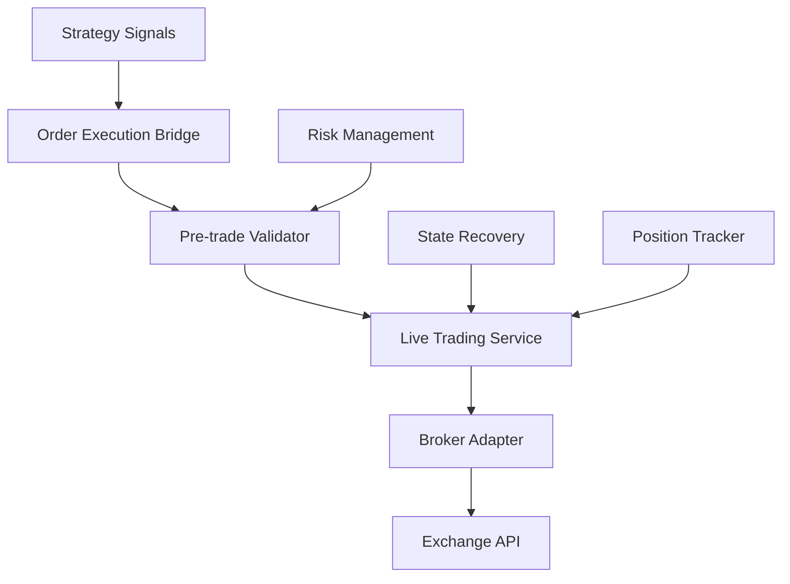
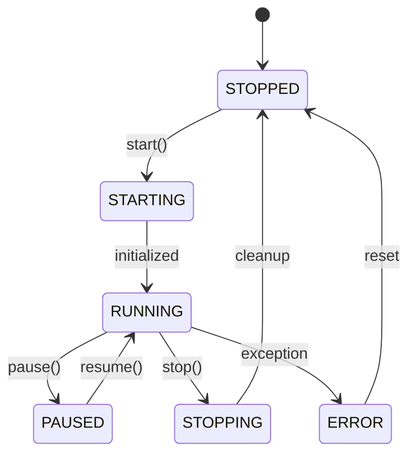

# Live Trading Module Documentation

## Module Overview

The Live Trading module manages real-time trading operations, from signal processing to order execution. It features state persistence, WebSocket order updates, pre-trade risk validation, and recovery mechanisms for 24/7 autonomous operation.

**Location**: `src/application/trading/`  
**Status**: ✅ **75% Complete**  
**Test Coverage**: ~60%

## Architecture



## Current Implementation

### Core Components

#### 1. **LiveTradingService** (`services/live_trading_service.py`)
- Session lifecycle management
- Signal processing and order generation
- Position and risk monitoring
- Error handling and recovery

#### 2. **OrderExecutionBridge** (`order_execution_bridge.py`)
- Translates signals to orders
- Routes orders to appropriate broker
- Handles order lifecycle events
- Manages order state transitions

#### 3. **LiveBrokerAdapter** (`adapters/live_broker_adapter.py`)
- Exchange API integration
- WebSocket order updates
- Balance and position queries
- Order placement and cancellation

#### 4. **PretradeRiskValidator** (`services/pretrade_risk_validator.py`)
- Pre-execution risk checks
- Position size validation
- Margin requirement verification
- Daily loss limit enforcement

#### 5. **StateRecoveryService** (`services/state_recovery_service.py`)
- Persistent state management
- Crash recovery procedures
- Order reconciliation
- Position synchronization

### Trading Session Management

```python
@dataclass
class TradingSession:
    id: UUID
    portfolio_id: UUID
    status: TradingSessionStatus
    started_at: datetime
    stopped_at: Optional[datetime]
    total_trades: int
    winning_trades: int
    losing_trades: int
    total_pnl: Decimal
    max_drawdown: Decimal
```

### Session States



## Usage Examples

### Starting Live Trading

```python
from src.application.trading.services.live_trading_service import LiveTradingService
from src.infrastructure.brokers.binance_futures_broker import BinanceFuturesBroker

# Initialize service
service = LiveTradingService(
    portfolio_repository=portfolio_repo,
    order_repository=order_repo,
    position_repository=position_repo,
    event_bus=event_bus,
    config=trading_config
)

# Configure broker
broker = BinanceFuturesBroker(
    api_key=config.api_key,
    api_secret=config.api_secret,
    testnet=config.use_testnet
)
service.set_broker(broker)

# Start trading session
session = await service.start_session(
    portfolio_id=portfolio_id,
    strategies=['sma_cross', 'macd_momentum'],
    symbols=['BTCUSDT', 'ETHUSDT'],
    dry_run=False  # Set True for paper trading
)

print(f"Session started: {session.id}")
```

### Handling Strategy Signals

```python
# Signal handler
async def handle_signal(signal_event: SignalGenerated):
    # Pre-trade validation
    if not await validator.validate_signal(signal_event):
        logger.warning(f"Signal rejected: {signal_event}")
        return
    
    # Create order from signal
    order = Order(
        symbol=signal_event.symbol,
        side=OrderSide.BUY if signal_event.signal_type == SignalType.BUY else OrderSide.SELL,
        quantity=calculate_position_size(signal_event),
        order_type=OrderType.MARKET,
        strategy_id=signal_event.strategy_id
    )
    
    # Execute order
    result = await service.execute_order(order)
    
    if result.success:
        logger.info(f"Order executed: {result.order_id}")
    else:
        logger.error(f"Order failed: {result.error}")

# Subscribe to signals
event_bus.subscribe('signal.generated', handle_signal)
```

### Order Management

```python
# Place order
order = await service.place_order(
    symbol='BTCUSDT',
    side=OrderSide.BUY,
    quantity=0.01,
    order_type=OrderType.LIMIT,
    price=45000,
    time_in_force='GTC',
    stop_loss=44000,
    take_profit=46000
)

# Cancel order
await service.cancel_order(order.id)

# Modify order
await service.modify_order(
    order_id=order.id,
    new_price=45500,
    new_quantity=0.02
)

# Get order status
status = await service.get_order_status(order.id)
print(f"Order {order.id}: {status}")
```

### Position Management

```python
# Get current positions
positions = await service.get_positions()
for position in positions:
    print(f"{position.symbol}: {position.quantity} @ {position.entry_price}")
    print(f"  P&L: ${position.unrealized_pnl:.2f}")
    print(f"  ROI: {position.roi_percentage:.2f}%")

# Close position
await service.close_position(
    symbol='BTCUSDT',
    reason='Manual close'
)

# Adjust position
await service.adjust_position(
    symbol='BTCUSDT',
    target_quantity=0.05  # Scale to new size
)
```

## Risk Validation

### Pre-trade Checks

```python
class PretradeRiskValidator:
    async def validate_signal(self, signal: SignalGenerated) -> bool:
        checks = [
            self.check_position_size(),
            self.check_leverage(),
            self.check_margin_requirements(),
            self.check_daily_loss_limit(),
            self.check_max_positions(),
            self.check_correlation_limits(),
            self.check_volatility_filters()
        ]
        
        results = await asyncio.gather(*checks)
        return all(results)
```

### Risk Rules

| Rule | Description | Default Limit |
|------|-------------|---------------|
| Position Size | Max % of portfolio per position | 10% |
| Leverage | Maximum leverage allowed | 10x |
| Margin | Minimum free margin required | 20% |
| Daily Loss | Maximum daily loss allowed | 2% |
| Max Positions | Concurrent position limit | 10 |
| Correlation | Max correlation between positions | 0.7 |

## State Management

### State Persistence

```python
# State is persisted to database
@dataclass
class TradingState:
    session_id: UUID
    portfolio_state: PortfolioState
    open_orders: List[Order]
    positions: List[Position]
    pending_signals: List[Signal]
    last_update: datetime
    
    def save(self):
        # Persist to database
        repository.save_state(self)
    
    @classmethod
    def recover(cls, session_id: UUID):
        # Recover from database
        return repository.load_state(session_id)
```

### Recovery Procedures

```python
async def recover_from_crash():
    # 1. Load last known state
    state = TradingState.recover(session_id)
    
    # 2. Sync with exchange
    exchange_orders = await broker.get_open_orders()
    exchange_positions = await broker.get_positions()
    
    # 3. Reconcile differences
    reconcile_orders(state.open_orders, exchange_orders)
    reconcile_positions(state.positions, exchange_positions)
    
    # 4. Resume operations
    await resume_trading(state)
```

## Live Strategy Runner

```python
from src.application.trading.live_strategy_runner import LiveStrategyRunner

# Initialize runner
runner = LiveStrategyRunner(
    strategy_config=config,
    market_data_service=market_data,
    event_bus=event_bus
)

# Add strategies
runner.add_strategy('sma_cross', SmaCrossStrategy())
runner.add_strategy('rsi', RSIStrategy())

# Start running
await runner.start()

# Strategies will now generate signals automatically
```

## WebSocket Integration

### Order Updates

```python
# WebSocket order stream handler
async def handle_order_update(update):
    order_id = update['orderId']
    status = update['status']
    
    if status == 'FILLED':
        await on_order_filled(order_id, update)
    elif status == 'PARTIALLY_FILLED':
        await on_order_partial_fill(order_id, update)
    elif status == 'CANCELED':
        await on_order_canceled(order_id, update)
    elif status == 'REJECTED':
        await on_order_rejected(order_id, update)

# Subscribe to order updates
ws_client.subscribe('order_update', handle_order_update)
```

### Position Updates

```python
# Real-time position tracking
async def handle_position_update(update):
    position = Position(
        symbol=update['symbol'],
        quantity=update['positionAmt'],
        entry_price=update['entryPrice'],
        mark_price=update['markPrice'],
        unrealized_pnl=update['unRealizedProfit']
    )
    
    await position_tracker.update(position)
    
    # Check for liquidation risk
    if position.margin_ratio > 0.8:
        await emergency_close(position)
```

## Configuration

### Trading Configuration

```python
@dataclass
class TradingConfig:
    # API Settings
    api_key: str
    api_secret: str
    testnet: bool = True
    
    # Trading Settings
    dry_run: bool = False
    max_positions: int = 10
    position_size_pct: float = 0.1
    
    # Risk Settings
    stop_loss_pct: float = 0.02
    take_profit_pct: float = 0.05
    max_daily_loss_pct: float = 0.02
    
    # Execution Settings
    use_market_orders: bool = True
    slippage_tolerance: float = 0.001
    retry_attempts: int = 3
    
    # Session Settings
    auto_restart: bool = True
    save_state_interval: int = 60  # seconds
```

### Environment Variables

```bash
# .env file
BINANCE_API_KEY=your_api_key
BINANCE_API_SECRET=your_api_secret
USE_TESTNET=true
DRY_RUN=false
MAX_POSITIONS=10
POSITION_SIZE_PCT=0.1
STOP_LOSS_PCT=0.02
AUTO_RESTART=true
```

## Performance Metrics

### Session Statistics

```python
# Get session statistics
stats = await service.get_session_stats()

print(f"Session Duration: {stats.duration}")
print(f"Total Trades: {stats.total_trades}")
print(f"Win Rate: {stats.win_rate:.2%}")
print(f"Profit Factor: {stats.profit_factor:.2f}")
print(f"Total P&L: ${stats.total_pnl:.2f}")
print(f"Max Drawdown: {stats.max_drawdown:.2%}")
print(f"Sharpe Ratio: {stats.sharpe_ratio:.2f}")
```

### Real-time Monitoring

```python
# Monitor live performance
async def monitor_performance():
    while service.is_running():
        metrics = await service.get_metrics()
        
        print(f"Open Positions: {metrics.position_count}")
        print(f"Total Exposure: ${metrics.total_exposure:.2f}")
        print(f"Unrealized P&L: ${metrics.unrealized_pnl:.2f}")
        print(f"Daily P&L: ${metrics.daily_pnl:.2f}")
        
        await asyncio.sleep(60)  # Update every minute
```

## Testing

### Unit Tests

```bash
# Run trading module tests
pytest tests/application/trading/ -v

# Test specific component
pytest tests/application/trading/test_live_service.py -v
```

### Integration Tests

```bash
# Test with testnet
pytest tests/integration/trading/ --testnet -v
```

### Paper Trading

```python
# Enable paper trading for testing
config = TradingConfig(
    dry_run=True,  # No real orders
    testnet=True,  # Use testnet data
    log_trades=True  # Log simulated trades
)

service = LiveTradingService(config=config)
```

## Error Handling

### Common Errors

```python
# Error handling patterns
try:
    result = await broker.place_order(order)
except InsufficientBalanceError:
    logger.error("Insufficient balance for order")
    await reduce_position_size(order)
except RateLimitError as e:
    logger.warning(f"Rate limited, waiting {e.retry_after}s")
    await asyncio.sleep(e.retry_after)
    await retry_order(order)
except NetworkError:
    logger.error("Network error, attempting recovery")
    await reconnect_and_retry()
```

### Circuit Breaker

```python
class CircuitBreaker:
    def __init__(self, failure_threshold=5, recovery_timeout=60):
        self.failure_count = 0
        self.failure_threshold = failure_threshold
        self.recovery_timeout = recovery_timeout
        self.last_failure_time = None
        self.state = 'CLOSED'  # CLOSED, OPEN, HALF_OPEN
    
    async def call(self, func, *args, **kwargs):
        if self.state == 'OPEN':
            if self.should_attempt_reset():
                self.state = 'HALF_OPEN'
            else:
                raise CircuitOpenError()
        
        try:
            result = await func(*args, **kwargs)
            self.on_success()
            return result
        except Exception as e:
            self.on_failure()
            raise e
```

## Known Issues

1. **Order Synchronization**: Occasional desync with exchange
2. **WebSocket Reconnection**: May miss updates during reconnect
3. **Partial Fills**: Complex handling for partial order fills
4. **Latency**: Network delays affect execution timing
5. **State Recovery**: Incomplete recovery in edge cases

## Future Enhancements

### High Priority
- [ ] Advanced order types (OCO, Iceberg)
- [ ] Portfolio rebalancing automation
- [ ] Multi-exchange support
- [ ] Copy trading functionality

### Medium Priority
- [ ] Options trading support
- [ ] Algorithmic order execution (TWAP, VWAP)
- [ ] Social sentiment integration
- [ ] Machine learning signal enhancement

### Low Priority
- [ ] DEX integration
- [ ] Cross-chain trading
- [ ] Arbitrage detection
- [ ] Market making strategies

## Best Practices

1. **Always use stop losses** for risk management
2. **Test on testnet first** before live trading
3. **Monitor continuously** during initial deployment
4. **Keep logs detailed** for debugging
5. **Implement gradual position sizing** 
6. **Use circuit breakers** for API calls
7. **Maintain state backups** regularly
8. **Set conservative limits** initially

## Troubleshooting

### Connection Issues

```bash
# Check API connectivity
python scripts/test_binance_connection.py

# Verify WebSocket stream
python scripts/test_websocket_stream.py
```

### Order Issues

```python
# Debug order placement
order.debug_info()
print(f"Symbol: {order.symbol}")
print(f"Side: {order.side}")
print(f"Quantity: {order.quantity}")
print(f"Price: {order.price}")
print(f"Margin Required: {order.margin_required}")
```

### Performance Issues

```python
# Profile execution time
import time

start = time.time()
await service.execute_order(order)
execution_time = time.time() - start

if execution_time > 1.0:
    logger.warning(f"Slow execution: {execution_time:.2f}s")
```

## Dependencies

- `ccxt`: Exchange connectivity
- `websockets`: WebSocket connections
- `asyncio`: Asynchronous operations
- `sqlalchemy`: State persistence
- `pydantic`: Data validation

## Related Modules

- **Strategy**: Generates trading signals
- **Risk Management**: Validates trades
- **Data Fetching**: Provides market data
- **Monitoring**: Tracks performance

## Contact & Support

For live trading support:
1. Check logs in `logs/trading/`
2. Review test cases in `tests/application/trading/`
3. Monitor system health via dashboard