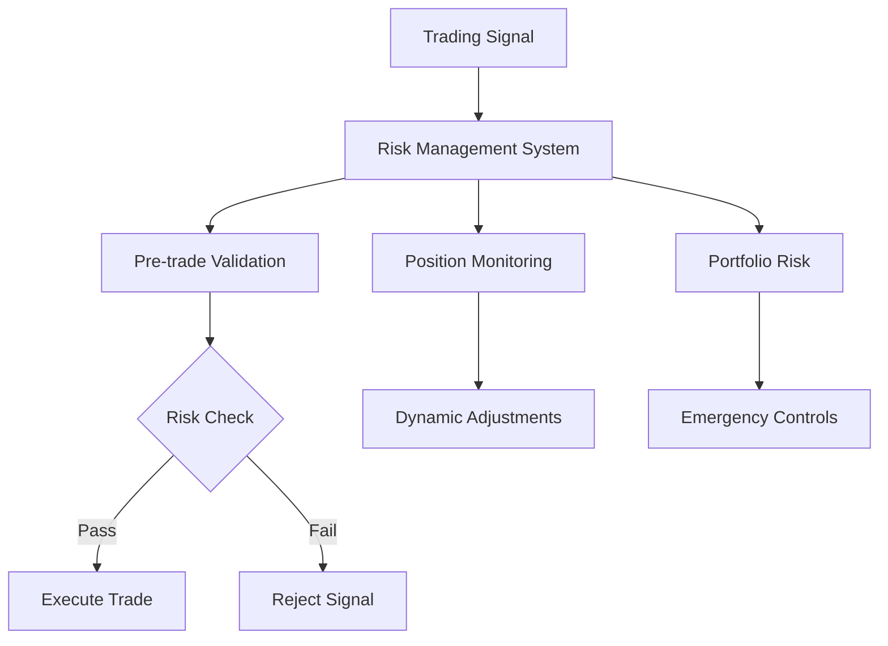

# Risk Management Module Documentation

## Module Overview

The Risk Management module provides comprehensive risk controls for live trading, including position sizing, exposure limits, drawdown protection, and emergency controls. It acts as the safety net for the trading system, preventing catastrophic losses.

**Location**: `src/application/trading/risk_management.py`  
**Status**: ⚠️ **60% Complete**  
**Test Coverage**: ~50%

## Architecture



## Current Implementation

### Core Components

#### 1. **RiskManagementSystem** (`risk_management.py`)
- Comprehensive risk assessment
- Real-time monitoring
- Emergency controls
- Risk metrics calculation

#### 2. **Risk Metrics**
```python
@dataclass
class RiskMetrics:
    total_exposure: float
    position_count: int
    unrealized_pnl: float
    realized_pnl: float
    daily_pnl: float
    max_drawdown: float
    current_drawdown: float
    risk_level: RiskLevel
    var_95: float  # Value at Risk
    sharpe_ratio: float
```

#### 3. **Risk Limits**
```python
@dataclass
class RiskLimits:
    max_position_size_pct: float = 0.10
    max_total_exposure_pct: float = 0.95
    max_daily_loss_pct: float = 0.02
    max_drawdown_pct: float = 0.10
    max_positions: int = 10
    max_correlation: float = 0.7
    min_free_margin_pct: float = 0.20
    max_leverage: float = 3.0
```

### Risk Levels

```python
class RiskLevel(Enum):
    LOW = "LOW"        # < 40% exposure
    MEDIUM = "MEDIUM"  # 40-70% exposure  
    HIGH = "HIGH"      # 70-90% exposure
    CRITICAL = "CRITICAL"  # > 90% exposure
```

## Risk Assessment Features

### Position Sizing

```python
def calculate_position_size(
    self,
    signal_strength: float,
    volatility: float,
    available_capital: float
) -> float:
    """
    Kelly Criterion-based position sizing
    """
    # Base position size
    base_size = available_capital * self.risk_limits.max_position_size_pct
    
    # Adjust for signal strength
    confidence_multiplier = min(signal_strength, 1.0)
    
    # Adjust for volatility (inverse relationship)
    volatility_multiplier = 1.0 / (1.0 + volatility)
    
    # Adjust for current risk level
    risk_multiplier = self._get_risk_multiplier()
    
    # Calculate final position size
    position_size = base_size * confidence_multiplier * volatility_multiplier * risk_multiplier
    
    # Apply minimum and maximum constraints
    position_size = max(self.min_position_size, position_size)
    position_size = min(self.max_position_size, position_size)
    
    return position_size
```

### Pre-trade Validation

```python
async def validate_trade(
    self,
    symbol: str,
    side: str,
    quantity: float,
    price: float
) -> ValidationResult:
    """
    Comprehensive pre-trade risk validation
    """
    checks = []
    
    # 1. Position size check
    position_value = quantity * price
    if position_value > self.current_capital * self.risk_limits.max_position_size_pct:
        checks.append(ValidationError("Position size exceeds limit"))
    
    # 2. Total exposure check
    new_exposure = self._calculate_new_exposure(position_value)
    if new_exposure > self.current_capital * self.risk_limits.max_total_exposure_pct:
        checks.append(ValidationError("Total exposure exceeds limit"))
    
    # 3. Daily loss check
    if self._get_daily_loss() > self.current_capital * self.risk_limits.max_daily_loss_pct:
        checks.append(ValidationError("Daily loss limit reached"))
    
    # 4. Correlation check
    correlation = await self._calculate_correlation(symbol)
    if correlation > self.risk_limits.max_correlation:
        checks.append(ValidationError("Position correlation too high"))
    
    # 5. Margin check
    required_margin = self._calculate_margin_requirement(quantity, price)
    if required_margin > self._get_free_margin():
        checks.append(ValidationError("Insufficient margin"))
    
    # 6. Leverage check
    effective_leverage = self._calculate_effective_leverage(new_exposure)
    if effective_leverage > self.risk_limits.max_leverage:
        checks.append(ValidationError("Leverage exceeds limit"))
    
    return ValidationResult(
        passed=len(checks) == 0,
        errors=checks
    )
```

## Risk Monitoring

### Real-time Position Monitoring

```python
async def monitor_positions(self):
    """
    Continuous position monitoring and adjustment
    """
    while self.monitoring_active:
        for position in self.positions.values():
            # Check stop loss
            if position['current_price'] <= position['stop_loss']:
                await self.close_position(position['symbol'], "Stop loss triggered")
            
            # Check take profit
            elif position['current_price'] >= position['take_profit']:
                await self.close_position(position['symbol'], "Take profit triggered")
            
            # Check trailing stop
            elif self._should_adjust_trailing_stop(position):
                await self.adjust_trailing_stop(position)
            
            # Check for margin call
            elif self._is_margin_call(position):
                await self.emergency_close(position['symbol'])
        
        await asyncio.sleep(1)  # Check every second
```

### Drawdown Management

```python
def update_drawdown(self):
    """
    Track and manage drawdown
    """
    # Update peak capital
    if self.current_capital > self.peak_capital:
        self.peak_capital = self.current_capital
    
    # Calculate current drawdown
    self.current_drawdown = (self.peak_capital - self.current_capital) / self.peak_capital
    
    # Update maximum drawdown
    if self.current_drawdown > self.max_drawdown:
        self.max_drawdown = self.current_drawdown
    
    # Check drawdown limits
    if self.current_drawdown > self.risk_limits.max_drawdown_pct:
        self.trigger_emergency_stop("Maximum drawdown exceeded")
```

## Risk Metrics Calculation

### Value at Risk (VaR)

```python
def calculate_var(self, confidence_level=0.95):
    """
    Calculate Value at Risk using historical simulation
    """
    returns = pd.Series(self.daily_pnl_history)
    
    # Calculate percentile
    var_percentile = (1 - confidence_level) * 100
    var_value = np.percentile(returns, var_percentile)
    
    # Convert to capital terms
    var_amount = abs(var_value * self.current_capital)
    
    return var_amount
```

### Sharpe Ratio

```python
def calculate_sharpe_ratio(self, risk_free_rate=0.02):
    """
    Calculate risk-adjusted returns
    """
    returns = pd.Series(self.daily_pnl_history) / self.initial_capital
    
    excess_returns = returns.mean() - (risk_free_rate / 252)
    
    if returns.std() > 0:
        sharpe = np.sqrt(252) * excess_returns / returns.std()
    else:
        sharpe = 0
    
    return sharpe
```

### Portfolio Correlation

```python
def calculate_portfolio_correlation(self):
    """
    Calculate correlation matrix for all positions
    """
    symbols = list(self.positions.keys())
    
    if len(symbols) < 2:
        return pd.DataFrame()
    
    # Get price data for all symbols
    price_data = {}
    for symbol in symbols:
        price_data[symbol] = self._get_price_history(symbol)
    
    # Create returns dataframe
    returns_df = pd.DataFrame(price_data).pct_change()
    
    # Calculate correlation matrix
    correlation_matrix = returns_df.corr()
    
    # Check for high correlations
    high_correlations = []
    for i in range(len(symbols)):
        for j in range(i+1, len(symbols)):
            corr = correlation_matrix.iloc[i, j]
            if abs(corr) > self.risk_limits.max_correlation:
                high_correlations.append({
                    'pair': (symbols[i], symbols[j]),
                    'correlation': corr
                })
    
    return correlation_matrix, high_correlations
```

## Emergency Controls

### Circuit Breaker

```python
def check_circuit_breaker(self):
    """
    Implement circuit breaker logic
    """
    # Check rapid loss
    recent_losses = self._get_losses_last_n_minutes(5)
    if recent_losses > self.current_capital * 0.01:  # 1% in 5 minutes
        self.trigger_emergency_stop("Rapid loss detected")
    
    # Check consecutive losses
    if self._consecutive_losses() >= 5:
        self.trigger_emergency_stop("Too many consecutive losses")
    
    # Check abnormal volume
    if self._detect_abnormal_volume():
        self.pause_trading("Abnormal volume detected")
```

### Emergency Stop

```python
async def trigger_emergency_stop(self, reason: str):
    """
    Emergency shutdown procedure
    """
    logger.critical(f"EMERGENCY STOP TRIGGERED: {reason}")
    
    # 1. Disable new trades
    self.trading_enabled = False
    self.emergency_triggered = True
    
    # 2. Cancel all pending orders
    await self.cancel_all_orders()
    
    # 3. Close all positions
    await self.close_all_positions(reason="Emergency stop")
    
    # 4. Send alerts
    await self.send_emergency_alert(reason)
    
    # 5. Save state
    self.save_emergency_state()
    
    # 6. Lock system
    self.system_locked = True
```

## Configuration

### Risk Configuration File

```yaml
# config/risk_management.yaml
risk_limits:
  max_position_size_pct: 0.10
  max_total_exposure_pct: 0.95
  max_daily_loss_pct: 0.02
  max_drawdown_pct: 0.10
  max_positions: 10
  max_correlation: 0.7
  min_free_margin_pct: 0.20
  max_leverage: 3.0

position_sizing:
  method: "kelly_criterion"  # or "fixed", "volatility_based"
  confidence_scaling: true
  volatility_adjustment: true
  
stop_loss:
  enabled: true
  default_pct: 0.02
  trailing_enabled: true
  trailing_activation: 0.01
  trailing_distance: 0.005

emergency:
  circuit_breaker_enabled: true
  rapid_loss_threshold: 0.01
  rapid_loss_window: 300  # seconds
  consecutive_loss_limit: 5
  auto_recovery: false
```

## Usage Examples

### Initialize Risk Management

```python
from src.application.trading.risk_management import RiskManagementSystem

# Initialize with custom limits
risk_mgmt = RiskManagementSystem(
    initial_capital=10000,
    risk_limits=RiskLimits(
        max_position_size_pct=0.05,
        max_drawdown_pct=0.15
    ),
    emergency_stop_loss=0.20
)

# Start monitoring
await risk_mgmt.start_monitoring()
```

### Risk-Adjusted Trading

```python
# Before placing trade
async def place_risk_adjusted_trade(signal):
    # Calculate position size
    position_size = risk_mgmt.calculate_position_size(
        signal_strength=signal.confidence,
        volatility=market_volatility,
        available_capital=risk_mgmt.get_available_capital()
    )
    
    # Validate trade
    validation = await risk_mgmt.validate_trade(
        symbol=signal.symbol,
        side=signal.side,
        quantity=position_size,
        price=current_price
    )
    
    if validation.passed:
        # Place trade
        order = await place_order(...)
        
        # Register with risk management
        risk_mgmt.register_position(order)
    else:
        logger.warning(f"Trade rejected: {validation.errors}")
```

## Testing

### Unit Tests

```bash
# Run risk management tests
pytest tests/application/trading/test_risk_management.py -v
```

### Risk Scenarios

```python
# Test extreme scenarios
def test_market_crash_scenario():
    risk_mgmt = RiskManagementSystem(initial_capital=10000)
    
    # Simulate 10% instant loss
    risk_mgmt.update_capital(9000)
    
    assert risk_mgmt.trading_enabled == False
    assert risk_mgmt.emergency_triggered == True
```

## Performance Impact

| Operation | Latency | Frequency |
|-----------|---------|-----------|
| Pre-trade validation | <10ms | Per trade |
| Position monitoring | <1ms | Every second |
| Risk metrics calculation | <50ms | Every minute |
| Correlation calculation | <100ms | Every 5 minutes |
| VaR calculation | <200ms | Every hour |

## Known Issues

1. **Correlation Calculation**: Slow with many positions
2. **VaR Accuracy**: Depends on historical data quality
3. **Slippage Estimation**: Not fully implemented
4. **Cross-asset Risk**: Limited support
5. **Options Greeks**: Not supported

## Future Enhancements

### High Priority ⚠️
- [ ] Portfolio-level correlation limits
- [ ] Dynamic position sizing based on volatility
- [ ] Improved trailing stop algorithms
- [ ] Cross-asset exposure management

### Medium Priority
- [ ] Options risk management (Greeks)
- [ ] Stress testing framework
- [ ] Monte Carlo risk simulation
- [ ] Risk parity allocation

### Low Priority
- [ ] Machine learning risk prediction
- [ ] Sentiment-based risk adjustment
- [ ] Regulatory compliance checks
- [ ] Multi-currency risk management

## Best Practices

1. **Start with conservative limits** and gradually increase
2. **Always use stop losses** on every position
3. **Monitor correlation** between positions
4. **Set daily loss limits** to prevent overtrading
5. **Regular risk audits** of the system
6. **Test emergency procedures** regularly
7. **Keep risk logs** for analysis
8. **Review and adjust** limits based on performance

## Troubleshooting

### Common Issues

**Position Size Too Small**
```python
# Check risk multipliers
print(f"Risk level: {risk_mgmt.risk_level}")
print(f"Available capital: {risk_mgmt.get_available_capital()}")
print(f"Risk multiplier: {risk_mgmt._get_risk_multiplier()}")
```

**Trades Being Rejected**
```python
# Debug validation
validation = await risk_mgmt.validate_trade(...)
for error in validation.errors:
    print(f"Failed check: {error}")
```

**Emergency Stop Triggered**
```python
# Check trigger conditions
print(f"Daily loss: {risk_mgmt._get_daily_loss()}")
print(f"Drawdown: {risk_mgmt.current_drawdown}")
print(f"Consecutive losses: {risk_mgmt._consecutive_losses()}")
```

## Integration Points

- **Live Trading**: Validates all trades
- **Strategy**: Provides position sizing
- **Monitoring**: Supplies risk metrics
- **Emergency System**: Triggers shutdowns

## Dependencies

- `numpy`: Statistical calculations
- `pandas`: Data analysis
- `scipy`: Advanced statistics
- `asyncio`: Async monitoring

## Contact & Support

For risk management support:
1. Review risk logs in `logs/risk/`
2. Check configuration in `config/risk_management.yaml`
3. Monitor dashboard risk metrics panel