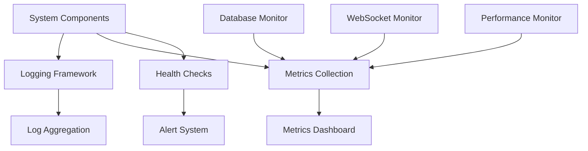

# Monitoring Module Documentation

## Module Overview

The Monitoring module provides system observability through logging, metrics collection, health checks, and performance tracking. It enables real-time monitoring of trading operations, data flow, and system health for 24/7 autonomous operation.

**Location**: `scripts/` and distributed throughout modules  
**Status**: ✅ **70% Complete**  
**Test Coverage**: ~40%

## Architecture



## Current Implementation

### Core Components

#### 1. **Logging System**
- Structured logging with levels
- Rotating file handlers
- Centralized log configuration
- Module-specific loggers

#### 2. **Database Monitoring** (`monitor_live_updates.py`)
- Real-time data update tracking
- Latency monitoring
- Gap detection
- Symbol status tracking

#### 3. **System Health Checks**
- API connectivity
- Database connection
- WebSocket status
- Memory usage

#### 4. **Performance Monitoring**
- Trade execution metrics
- Strategy performance
- Data processing speed
- System resource usage

## Logging Configuration

### Logger Setup

```python
import logging
import logging.handlers
from pathlib import Path

def setup_logging():
    """
    Configure comprehensive logging system
    """
    # Create logs directory
    log_dir = Path("logs")
    log_dir.mkdir(exist_ok=True)
    
    # Configure root logger
    logging.basicConfig(
        level=logging.INFO,
        format='%(asctime)s - %(name)s - %(levelname)s - %(message)s',
        handlers=[
            # Console handler
            logging.StreamHandler(),
            
            # File handler with rotation
            logging.handlers.RotatingFileHandler(
                log_dir / "trading.log",
                maxBytes=10_000_000,  # 10MB
                backupCount=10
            ),
            
            # Error file handler
            logging.handlers.RotatingFileHandler(
                log_dir / "errors.log",
                maxBytes=5_000_000,  # 5MB
                backupCount=5,
                level=logging.ERROR
            )
        ]
    )
    
    # Module-specific loggers
    loggers = {
        'trading': logging.INFO,
        'market_data': logging.INFO,
        'risk': logging.WARNING,
        'database': logging.INFO,
        'websocket': logging.DEBUG
    }
    
    for name, level in loggers.items():
        logger = logging.getLogger(f"src.{name}")
        logger.setLevel(level)
```

### Log Levels

| Level | Usage | Example |
|-------|-------|---------|
| DEBUG | Detailed diagnostic info | `logger.debug(f"Order details: {order}")` |
| INFO | General information | `logger.info("Trading session started")` |
| WARNING | Warning conditions | `logger.warning("High latency detected")` |
| ERROR | Error conditions | `logger.error(f"Order failed: {e}")` |
| CRITICAL | Critical failures | `logger.critical("System shutdown")` |

## Monitoring Scripts

### Live Data Monitor

```python
#!/usr/bin/env python3
"""
Monitor live data updates - monitor_live_updates.py
"""
import time
from datetime import datetime
from sqlalchemy import create_engine, text

def check_updates():
    engine = create_engine(DATABASE_URL)
    
    with engine.connect() as conn:
        result = conn.execute(text('''
            SELECT 
                symbol,
                MAX(open_time) as latest,
                NOW() AT TIME ZONE 'UTC' as current_time,
                COUNT(*) as total_count
            FROM kline_data
            GROUP BY symbol
            ORDER BY symbol
        '''))
        
        for row in result:
            latest = row.latest
            current = row.current_time
            diff = (current - latest).total_seconds() / 60
            
            if diff < 10:
                status = '🟢 LIVE'
            elif diff < 60:
                status = '🟡 DELAYED'
            else:
                status = '🔴 STALE'
            
            print(f"{row.symbol}: {status} (Last: {latest}, Delay: {diff:.1f}m)")

if __name__ == "__main__":
    while True:
        check_updates()
        time.sleep(60)
```

### Performance Monitor

```python
class PerformanceMonitor:
    """
    Monitor system performance metrics
    """
    def __init__(self):
        self.metrics = {
            'trades_executed': 0,
            'signals_generated': 0,
            'orders_placed': 0,
            'orders_filled': 0,
            'orders_cancelled': 0,
            'average_latency': 0,
            'errors_count': 0
        }
        self.latencies = []
    
    def record_trade(self, trade_time: float):
        """Record trade execution time"""
        self.metrics['trades_executed'] += 1
        self.latencies.append(trade_time)
        self.metrics['average_latency'] = sum(self.latencies) / len(self.latencies)
    
    def get_metrics(self) -> dict:
        """Get current metrics"""
        return {
            **self.metrics,
            'success_rate': self.calculate_success_rate(),
            'throughput': self.calculate_throughput()
        }
    
    def calculate_success_rate(self) -> float:
        """Calculate order success rate"""
        total = self.metrics['orders_placed']
        if total == 0:
            return 0
        return self.metrics['orders_filled'] / total
    
    def calculate_throughput(self) -> float:
        """Calculate trades per minute"""
        # Implementation based on time window
        pass
```

## Health Checks

### System Health Monitor

```python
class SystemHealthMonitor:
    """
    Comprehensive system health monitoring
    """
    def __init__(self):
        self.checks = {
            'database': self.check_database,
            'api': self.check_api,
            'websocket': self.check_websocket,
            'disk_space': self.check_disk_space,
            'memory': self.check_memory,
            'cpu': self.check_cpu
        }
        self.status = {}
    
    async def run_health_checks(self) -> dict:
        """Run all health checks"""
        results = {}
        
        for name, check_func in self.checks.items():
            try:
                result = await check_func()
                results[name] = {
                    'status': 'healthy' if result else 'unhealthy',
                    'timestamp': datetime.now(),
                    'details': result
                }
            except Exception as e:
                results[name] = {
                    'status': 'error',
                    'timestamp': datetime.now(),
                    'error': str(e)
                }
        
        self.status = results
        return results
    
    async def check_database(self) -> bool:
        """Check database connectivity"""
        try:
            engine = create_engine(DATABASE_URL)
            with engine.connect() as conn:
                result = conn.execute(text("SELECT 1"))
                return result.scalar() == 1
        except:
            return False
    
    async def check_api(self) -> bool:
        """Check API connectivity"""
        try:
            response = await client.get_server_time()
            return 'serverTime' in response
        except:
            return False
    
    async def check_websocket(self) -> bool:
        """Check WebSocket connection"""
        return ws_client.is_connected()
    
    async def check_disk_space(self) -> dict:
        """Check available disk space"""
        import shutil
        stat = shutil.disk_usage("/")
        return {
            'total': stat.total,
            'used': stat.used,
            'free': stat.free,
            'percent': (stat.used / stat.total) * 100
        }
    
    async def check_memory(self) -> dict:
        """Check memory usage"""
        import psutil
        mem = psutil.virtual_memory()
        return {
            'total': mem.total,
            'available': mem.available,
            'percent': mem.percent,
            'used': mem.used
        }
    
    async def check_cpu(self) -> dict:
        """Check CPU usage"""
        import psutil
        return {
            'percent': psutil.cpu_percent(interval=1),
            'count': psutil.cpu_count()
        }
```

### Health Check Endpoints

```python
from fastapi import FastAPI, HTTPException

app = FastAPI()

@app.get("/health")
async def health_check():
    """Basic health check"""
    return {"status": "healthy"}

@app.get("/health/detailed")
async def detailed_health():
    """Detailed health check"""
    monitor = SystemHealthMonitor()
    results = await monitor.run_health_checks()
    
    # Determine overall status
    unhealthy = [k for k, v in results.items() if v['status'] != 'healthy']
    
    if unhealthy:
        raise HTTPException(status_code=503, detail={
            "status": "unhealthy",
            "failed_checks": unhealthy,
            "details": results
        })
    
    return {
        "status": "healthy",
        "checks": results
    }
```

## Metrics Collection

### Metrics Collector

```python
from dataclasses import dataclass
from typing import Dict, List
import time

@dataclass
class Metric:
    name: str
    value: float
    timestamp: float
    tags: Dict[str, str]

class MetricsCollector:
    """
    Collect and aggregate system metrics
    """
    def __init__(self):
        self.metrics: List[Metric] = []
        self.aggregations = {}
    
    def record(self, name: str, value: float, tags: Dict[str, str] = None):
        """Record a metric"""
        metric = Metric(
            name=name,
            value=value,
            timestamp=time.time(),
            tags=tags or {}
        )
        self.metrics.append(metric)
        
        # Update aggregations
        if name not in self.aggregations:
            self.aggregations[name] = []
        self.aggregations[name].append(value)
    
    def get_stats(self, name: str) -> dict:
        """Get statistics for a metric"""
        if name not in self.aggregations:
            return {}
        
        values = self.aggregations[name]
        return {
            'count': len(values),
            'sum': sum(values),
            'mean': sum(values) / len(values),
            'min': min(values),
            'max': max(values),
            'last': values[-1]
        }
    
    def export_prometheus(self) -> str:
        """Export metrics in Prometheus format"""
        lines = []
        for name, values in self.aggregations.items():
            if values:
                lines.append(f"# TYPE {name} gauge")
                lines.append(f"{name} {values[-1]}")
        return "\n".join(lines)
```

### Key Metrics to Track

| Metric | Description | Alert Threshold |
|--------|-------------|-----------------|
| `trades.executed` | Total trades executed | - |
| `trades.latency` | Trade execution time | >1s |
| `orders.success_rate` | Order fill rate | <80% |
| `data.latency` | Data feed latency | >100ms |
| `data.gaps` | Missing data points | >10/hour |
| `system.memory` | Memory usage | >80% |
| `system.cpu` | CPU usage | >90% |
| `errors.rate` | Error rate | >5/min |
| `websocket.disconnects` | Disconnection count | >3/hour |

## Alerting System

### Alert Manager

```python
from enum import Enum
import asyncio

class AlertLevel(Enum):
    INFO = "info"
    WARNING = "warning"
    ERROR = "error"
    CRITICAL = "critical"

class AlertManager:
    """
    Manage system alerts and notifications
    """
    def __init__(self):
        self.alert_handlers = {
            AlertLevel.INFO: [self.log_alert],
            AlertLevel.WARNING: [self.log_alert, self.email_alert],
            AlertLevel.ERROR: [self.log_alert, self.email_alert, self.sms_alert],
            AlertLevel.CRITICAL: [self.log_alert, self.email_alert, self.sms_alert, self.phone_call]
        }
    
    async def send_alert(self, level: AlertLevel, message: str, details: dict = None):
        """Send alert through configured channels"""
        handlers = self.alert_handlers.get(level, [])
        
        for handler in handlers:
            try:
                await handler(level, message, details)
            except Exception as e:
                logging.error(f"Failed to send alert: {e}")
    
    async def log_alert(self, level, message, details):
        """Log alert to file"""
        logger = logging.getLogger("alerts")
        logger.log(
            getattr(logging, level.value.upper()),
            f"{message} - {details}"
        )
    
    async def email_alert(self, level, message, details):
        """Send email alert"""
        # Email implementation
        pass
    
    async def sms_alert(self, level, message, details):
        """Send SMS alert"""
        # SMS implementation
        pass
```

### Alert Rules

```yaml
# config/alert_rules.yaml
rules:
  - name: high_error_rate
    condition: "errors.rate > 5"
    level: warning
    message: "High error rate detected"
    
  - name: low_success_rate
    condition: "orders.success_rate < 0.8"
    level: warning
    message: "Low order success rate"
    
  - name: high_latency
    condition: "trades.latency > 1000"
    level: error
    message: "High trade execution latency"
    
  - name: memory_critical
    condition: "system.memory > 90"
    level: critical
    message: "Critical memory usage"
    
  - name: data_stale
    condition: "data.last_update > 300"
    level: error
    message: "Market data is stale"
```

## Dashboard Integration

### Metrics API

```python
@app.get("/api/metrics")
async def get_metrics():
    """Get current system metrics"""
    return {
        'performance': performance_monitor.get_metrics(),
        'health': await health_monitor.run_health_checks(),
        'trading': {
            'positions': len(trading_service.positions),
            'daily_pnl': trading_service.get_daily_pnl(),
            'total_volume': trading_service.get_total_volume()
        },
        'system': {
            'uptime': get_uptime(),
            'memory': get_memory_usage(),
            'cpu': get_cpu_usage()
        }
    }

@app.get("/api/metrics/history")
async def get_metrics_history(hours: int = 24):
    """Get historical metrics"""
    # Return time-series metrics data
    pass
```

## Log Analysis

### Log Parser

```python
import re
from collections import Counter

class LogAnalyzer:
    """
    Analyze log files for patterns and issues
    """
    def __init__(self, log_file: str):
        self.log_file = log_file
        self.patterns = {
            'errors': r'ERROR|CRITICAL',
            'warnings': r'WARNING',
            'trades': r'Trade executed|Order filled',
            'connections': r'Connected|Disconnected',
            'performance': r'Latency|Slow|Timeout'
        }
    
    def analyze(self) -> dict:
        """Analyze log file"""
        results = {
            'error_count': 0,
            'warning_count': 0,
            'trade_count': 0,
            'top_errors': Counter(),
            'timeline': []
        }
        
        with open(self.log_file, 'r') as f:
            for line in f:
                for pattern_name, pattern in self.patterns.items():
                    if re.search(pattern, line):
                        # Process matching line
                        pass
        
        return results
```

## Testing

### Monitoring Tests

```bash
# Test monitoring scripts
pytest tests/monitoring/ -v

# Test health checks
curl http://localhost:8000/health/detailed

# Test metrics collection
python scripts/test_metrics_collection.py
```

## Known Issues

1. **Log Rotation**: May lose logs during rotation
2. **Metric Storage**: Limited historical data retention
3. **Alert Fatigue**: Too many non-critical alerts
4. **Dashboard Lag**: Metrics update delay
5. **Resource Usage**: Monitoring overhead

## Future Enhancements

### High Priority
- [ ] Prometheus integration
- [ ] Grafana dashboards
- [ ] Centralized logging (ELK stack)
- [ ] Advanced alerting rules

### Medium Priority
- [ ] Distributed tracing
- [ ] Custom metrics SDK
- [ ] Anomaly detection
- [ ] Performance profiling

### Low Priority
- [ ] Machine learning alerts
- [ ] Predictive monitoring
- [ ] Cloud monitoring integration
- [ ] Mobile app notifications

## Best Practices

1. **Log at appropriate levels** - Don't log everything as INFO
2. **Include context** in log messages
3. **Use structured logging** for easier parsing
4. **Monitor key metrics** not everything
5. **Set meaningful thresholds** for alerts
6. **Regular log rotation** and cleanup
7. **Test alert channels** regularly
8. **Document monitoring procedures**

## Troubleshooting

### High Memory Usage

```bash
# Check memory consumers
ps aux | sort -rk 4 | head

# Check Python memory
python -m memory_profiler scripts/monitor.py
```

### Missing Logs

```bash
# Check log rotation
ls -la logs/*.log*

# Check disk space
df -h /var/log
```

### Alert Not Firing

```python
# Test alert manually
alert_manager = AlertManager()
await alert_manager.send_alert(
    AlertLevel.WARNING,
    "Test alert",
    {"test": True}
)
```

## Dependencies

- `logging`: Python logging
- `psutil`: System monitoring
- `prometheus_client`: Metrics export
- `asyncio`: Async operations

## Related Modules

- **Live Trading**: Generates trading metrics
- **Risk Management**: Provides risk metrics
- **Data Fetching**: Monitors data flow
- **Web Dashboard**: Displays metrics

## Contact & Support

For monitoring support:
1. Check logs in `logs/`
2. Review monitoring scripts in `scripts/`
3. Access dashboard at http://localhost:5174