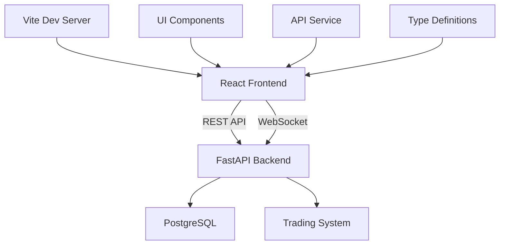

# Frontend/Web Dashboard Module Documentation

## Module Overview

The Frontend module provides a modern, real-time web dashboard for monitoring and controlling the trading system. Built with React, TypeScript, and Tailwind CSS, it offers comprehensive portfolio visualization, strategy management, and performance analytics.

**Location**: `web/`  
**Status**: ✅ **85% Complete**  
**Test Coverage**: ~30%

## Architecture



## Technology Stack

### Frontend
- **Framework**: React 18
- **Language**: TypeScript
- **Build Tool**: Vite
- **Styling**: Tailwind CSS
- **UI Components**: Custom shadcn/ui-inspired
- **Icons**: Lucide React
- **State Management**: React Hooks

### Backend
- **Framework**: FastAPI
- **Language**: Python 3.8+
- **Database**: PostgreSQL
- **CORS**: Enabled for development
- **Documentation**: Auto-generated OpenAPI

## Project Structure

```
web/
├── backend/
│   ├── api_server.py         # FastAPI server
│   ├── requirements.txt      # Python dependencies
│   └── venv/                 # Virtual environment
├── frontend/
│   ├── src/
│   │   ├── App.tsx           # Main application
│   │   ├── components/       # React components
│   │   │   ├── BacktestTab.tsx
│   │   │   └── ui/          # Reusable UI components
│   │   ├── services/         # API integration
│   │   ├── types/           # TypeScript definitions
│   │   └── index.css        # Global styles
│   ├── package.json         # Node dependencies
│   └── vite.config.ts       # Vite configuration
├── start.sh                 # Startup script
└── README.md               # Documentation
```

## Features Implemented

### Dashboard Overview
- **Portfolio Summary**: Total balance, daily P&L, win rate
- **Active Positions**: Real-time position tracking with P&L
- **Recent Trades**: Transaction history with details
- **Strategy Status**: Active strategies with controls
- **Performance Metrics**: Charts and statistics

### Real-time Updates
- Auto-refresh every 5 seconds
- WebSocket support for live data
- Loading states and error handling
- Responsive design for all devices

## Frontend Components

### Main Application (`App.tsx`)

```tsx
import React, { useState, useEffect } from 'react';
import { Card, CardContent, CardHeader, CardTitle } from './components/ui/card';
import { Badge } from './components/ui/badge';
import api from './services/api';

function App() {
  const [portfolio, setPortfolio] = useState<Portfolio | null>(null);
  const [positions, setPositions] = useState<Position[]>([]);
  const [trades, setTrades] = useState<Trade[]>([]);
  const [strategies, setStrategies] = useState<Strategy[]>([]);
  
  useEffect(() => {
    fetchData();
    const interval = setInterval(fetchData, 5000);
    return () => clearInterval(interval);
  }, []);
  
  const fetchData = async () => {
    try {
      const [portfolioData, positionsData, tradesData, strategiesData] = 
        await Promise.all([
          api.getPortfolio(),
          api.getPositions(),
          api.getTrades(),
          api.getStrategies()
        ]);
      
      setPortfolio(portfolioData);
      setPositions(positionsData);
      setTrades(tradesData);
      setStrategies(strategiesData);
    } catch (error) {
      console.error('Failed to fetch data:', error);
    }
  };
  
  return (
    <div className="container mx-auto p-4">
      {/* Dashboard content */}
    </div>
  );
}
```

### UI Components

#### Card Component (`components/ui/card.tsx`)
```tsx
import * as React from "react"
import { cn } from "@/lib/utils"

const Card = React.forwardRef<
  HTMLDivElement,
  React.HTMLAttributes<HTMLDivElement>
>(({ className, ...props }, ref) => (
  <div
    ref={ref}
    className={cn(
      "rounded-lg border bg-card text-card-foreground shadow-sm",
      className
    )}
    {...props}
  />
))
Card.displayName = "Card"
```

#### Badge Component (`components/ui/badge.tsx`)
```tsx
import * as React from "react"
import { cva, type VariantProps } from "class-variance-authority"

const badgeVariants = cva(
  "inline-flex items-center rounded-full border px-2.5 py-0.5 text-xs font-semibold",
  {
    variants: {
      variant: {
        default: "border-transparent bg-primary text-primary-foreground",
        secondary: "border-transparent bg-secondary text-secondary-foreground",
        success: "border-transparent bg-green-500 text-white",
        warning: "border-transparent bg-yellow-500 text-white",
        danger: "border-transparent bg-red-500 text-white",
      },
    },
    defaultVariants: {
      variant: "default",
    },
  }
)
```

## API Integration

### API Service (`services/api.ts`)

```typescript
const API_BASE_URL = import.meta.env.VITE_API_URL || 'http://localhost:8000';

class ApiService {
  private async request<T>(endpoint: string, options?: RequestInit): Promise<T> {
    const response = await fetch(`${API_BASE_URL}${endpoint}`, {
      ...options,
      headers: {
        'Content-Type': 'application/json',
        ...options?.headers,
      },
    });
    
    if (!response.ok) {
      throw new Error(`API Error: ${response.statusText}`);
    }
    
    return response.json();
  }
  
  async getPortfolio(): Promise<Portfolio> {
    return this.request<Portfolio>('/api/portfolio');
  }
  
  async getPositions(): Promise<Position[]> {
    return this.request<Position[]>('/api/positions');
  }
  
  async getTrades(limit = 20): Promise<Trade[]> {
    return this.request<Trade[]>(`/api/trades?limit=${limit}`);
  }
  
  async getStrategies(): Promise<Strategy[]> {
    return this.request<Strategy[]>('/api/strategies');
  }
  
  async toggleStrategy(id: string): Promise<void> {
    return this.request(`/api/strategies/${id}/toggle`, {
      method: 'POST',
    });
  }
}

export default new ApiService();
```

## Type Definitions

### TypeScript Types (`types/index.ts`)

```typescript
export interface Portfolio {
  total_balance: number;
  available_balance: number;
  total_pnl: number;
  daily_pnl: number;
  win_rate: number;
  total_trades: number;
  open_positions: number;
}

export interface Position {
  id: string;
  symbol: string;
  side: 'BUY' | 'SELL';
  quantity: number;
  entry_price: number;
  current_price: number;
  mark_price: number;
  pnl: number;
  pnl_percentage: number;
  margin: number;
  leverage: number;
  opened_at: string;
}

export interface Trade {
  id: string;
  symbol: string;
  side: 'BUY' | 'SELL';
  quantity: number;
  price: number;
  fee: number;
  pnl: number;
  strategy: string;
  executed_at: string;
}

export interface Strategy {
  id: string;
  name: string;
  status: 'active' | 'paused' | 'stopped';
  type: string;
  symbols: string[];
  performance: {
    total_trades: number;
    win_rate: number;
    total_pnl: number;
    sharpe_ratio: number;
  };
}
```

## Backend API

### FastAPI Server (`backend/api_server.py`)

```python
from fastapi import FastAPI, HTTPException
from fastapi.middleware.cors import CORSMiddleware
import psycopg2
from psycopg2.extras import RealDictCursor
import os
from datetime import datetime, timedelta

app = FastAPI(title="Trading Bot API")

# CORS configuration
app.add_middleware(
    CORSMiddleware,
    allow_origins=["http://localhost:5174", "http://localhost:5173"],
    allow_credentials=True,
    allow_methods=["*"],
    allow_headers=["*"],
)

# Database connection
def get_db():
    return psycopg2.connect(
        host=os.getenv("DB_HOST", "localhost"),
        database=os.getenv("DB_NAME", "tradingbot"),
        user=os.getenv("DB_USER", "postgres"),
        password=os.getenv("DB_PASSWORD", ""),
        cursor_factory=RealDictCursor
    )

@app.get("/api/portfolio")
async def get_portfolio():
    """Get portfolio summary"""
    try:
        with get_db() as conn:
            with conn.cursor() as cur:
                # Get portfolio data
                cur.execute("""
                    SELECT 
                        SUM(balance) as total_balance,
                        SUM(available_balance) as available_balance
                    FROM portfolios
                    WHERE active = true
                """)
                portfolio = cur.fetchone()
                
                # Get P&L data
                cur.execute("""
                    SELECT 
                        SUM(pnl) as total_pnl,
                        SUM(CASE WHEN DATE(executed_at) = CURRENT_DATE 
                            THEN pnl ELSE 0 END) as daily_pnl,
                        COUNT(*) as total_trades,
                        AVG(CASE WHEN pnl > 0 THEN 1 ELSE 0 END) as win_rate
                    FROM trades
                """)
                pnl_data = cur.fetchone()
                
                return {
                    **portfolio,
                    **pnl_data,
                    'open_positions': get_position_count()
                }
    except Exception as e:
        raise HTTPException(status_code=500, detail=str(e))

@app.get("/api/positions")
async def get_positions():
    """Get open positions"""
    try:
        with get_db() as conn:
            with conn.cursor() as cur:
                cur.execute("""
                    SELECT 
                        p.*,
                        k.close as current_price,
                        (k.close - p.entry_price) * p.quantity as pnl,
                        ((k.close - p.entry_price) / p.entry_price) * 100 as pnl_percentage
                    FROM positions p
                    LEFT JOIN LATERAL (
                        SELECT close 
                        FROM kline_data 
                        WHERE symbol = p.symbol 
                        ORDER BY open_time DESC 
                        LIMIT 1
                    ) k ON true
                    WHERE p.status = 'open'
                    ORDER BY p.opened_at DESC
                """)
                return cur.fetchall()
    except Exception as e:
        raise HTTPException(status_code=500, detail=str(e))
```

## Styling

### Tailwind Configuration

```javascript
// tailwind.config.js
module.exports = {
  content: [
    "./src/**/*.{js,jsx,ts,tsx}",
  ],
  theme: {
    extend: {
      colors: {
        primary: '#3B82F6',
        secondary: '#10B981',
        danger: '#EF4444',
        warning: '#F59E0B',
        background: '#0F172A',
        foreground: '#F1F5F9',
      },
      animation: {
        'pulse-slow': 'pulse 3s cubic-bezier(0.4, 0, 0.6, 1) infinite',
      }
    },
  },
  plugins: [],
}
```

### Global Styles (`index.css`)

```css
@tailwind base;
@tailwind components;
@tailwind utilities;

@layer base {
  :root {
    --background: 222.2 84% 4.9%;
    --foreground: 210 40% 98%;
    --card: 222.2 84% 4.9%;
    --card-foreground: 210 40% 98%;
    --primary: 217.2 91.2% 59.8%;
    --primary-foreground: 222.2 47.4% 11.2%;
  }
}

@layer components {
  .card-gradient {
    @apply bg-gradient-to-br from-gray-800 to-gray-900;
  }
  
  .status-indicator {
    @apply inline-flex h-2 w-2 rounded-full;
  }
  
  .status-active {
    @apply bg-green-500 animate-pulse;
  }
  
  .status-inactive {
    @apply bg-gray-500;
  }
}
```

## Deployment

### Development Setup

```bash
# Backend
cd web/backend
python -m venv venv
source venv/bin/activate
pip install -r requirements.txt
python api_server.py

# Frontend
cd web/frontend
npm install
npm run dev
```

### Production Build

```bash
# Build frontend
cd web/frontend
npm run build

# Serve with production server
npm install -g serve
serve -s dist -p 3000

# Or use nginx
cp -r dist/* /var/www/html/
```

### Docker Deployment

```dockerfile
# Frontend Dockerfile
FROM node:18-alpine AS builder
WORKDIR /app
COPY package*.json ./
RUN npm ci
COPY . .
RUN npm run build

FROM nginx:alpine
COPY --from=builder /app/dist /usr/share/nginx/html
COPY nginx.conf /etc/nginx/conf.d/default.conf
EXPOSE 80
```

## Testing

### Frontend Tests

```bash
# Run tests
npm test

# Run with coverage
npm run test:coverage

# E2E tests
npm run test:e2e
```

### Test Examples

```typescript
// App.test.tsx
import { render, screen, waitFor } from '@testing-library/react';
import App from './App';
import api from './services/api';

jest.mock('./services/api');

describe('App', () => {
  it('renders portfolio data', async () => {
    api.getPortfolio.mockResolvedValue({
      total_balance: 10000,
      daily_pnl: 150,
      win_rate: 0.65
    });
    
    render(<App />);
    
    await waitFor(() => {
      expect(screen.getByText('$10,000.00')).toBeInTheDocument();
      expect(screen.getByText('65%')).toBeInTheDocument();
    });
  });
});
```

## Performance Optimization

### Code Splitting

```typescript
// Lazy load heavy components
const BacktestTab = React.lazy(() => import('./components/BacktestTab'));

// Use Suspense
<Suspense fallback={<Loading />}>
  <BacktestTab />
</Suspense>
```

### Memoization

```typescript
// Memoize expensive calculations
const sortedTrades = useMemo(
  () => trades.sort((a, b) => b.executed_at - a.executed_at),
  [trades]
);

// Memoize components
const TradeRow = React.memo(({ trade }) => {
  return <tr>...</tr>;
});
```

## Known Issues

1. **WebSocket Reconnection**: Manual refresh needed after disconnect
2. **Mobile Responsiveness**: Some tables need optimization
3. **Chart Performance**: Lag with large datasets
4. **Error Boundaries**: Not fully implemented
5. **Accessibility**: Needs ARIA improvements

## Future Enhancements

### High Priority
- [ ] WebSocket integration for real-time updates
- [ ] Advanced charting with TradingView
- [ ] Strategy parameter adjustment UI
- [ ] Trade execution interface

### Medium Priority
- [ ] Dark/light theme toggle
- [ ] Multi-language support
- [ ] Export functionality (CSV, PDF)
- [ ] Mobile app (React Native)

### Low Priority
- [ ] Social features
- [ ] News integration
- [ ] AI insights panel
- [ ] Voice commands

## Best Practices

1. **Use TypeScript** for type safety
2. **Component composition** over inheritance
3. **Memoize expensive operations**
4. **Handle loading and error states**
5. **Implement proper error boundaries**
6. **Use semantic HTML** for accessibility
7. **Optimize bundle size** with code splitting
8. **Test critical user flows**

## Troubleshooting

### Common Issues

**CORS Errors**
```python
# Check backend CORS settings
app.add_middleware(
    CORSMiddleware,
    allow_origins=["*"],  # Development only!
)
```

**API Connection Failed**
```typescript
// Check API URL
console.log('API URL:', import.meta.env.VITE_API_URL);

// Test connection
fetch('http://localhost:8000/health')
  .then(r => r.json())
  .then(console.log);
```

**Build Errors**
```bash
# Clear cache and rebuild
rm -rf node_modules package-lock.json
npm install
npm run build
```

## Dependencies

### Frontend
- `react`: UI framework
- `typescript`: Type safety
- `vite`: Build tool
- `tailwindcss`: Styling
- `lucide-react`: Icons

### Backend
- `fastapi`: API framework
- `psycopg2`: PostgreSQL driver
- `uvicorn`: ASGI server
- `python-dotenv`: Environment variables

## Related Modules

- **API Server**: Provides data endpoints
- **Database**: Stores trading data
- **Live Trading**: Generates real-time data
- **Monitoring**: System metrics display

## Contact & Support

For frontend support:
1. Check browser console for errors
2. Review network tab for API calls
3. Access API docs at http://localhost:8000/docs